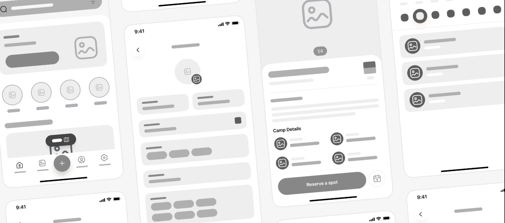
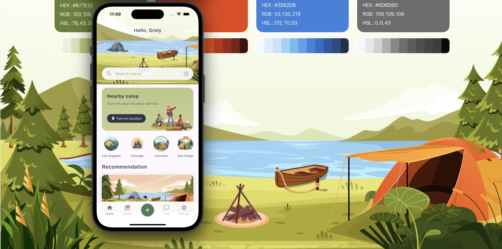
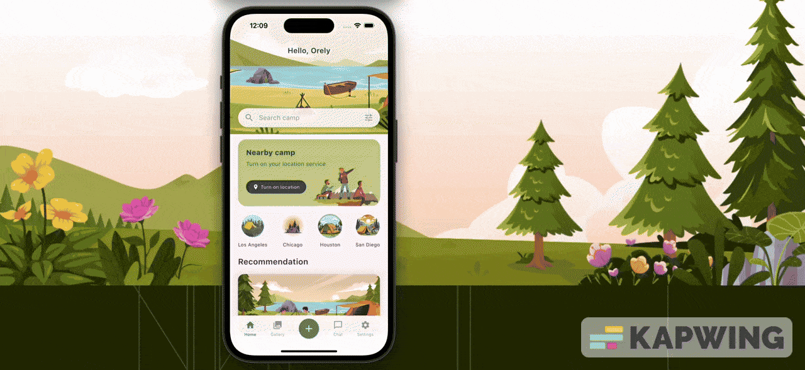

# Camp Buddy App

A beautifully crafted **UI‑only Flutter mobile app** showcasing campsite booking and outdoor adventure style mobile screens. This project focuses on elegant UI components, creative layouts, and nature‑inspired visual experience — perfect for learning, UI inspiration, or starting your own travel/outdoor app.

---


## 🌿 About the Project

Camp Buddy App is designed to give users a seamless and visually appealing interface to explore campsites, view details, check amenities, browse galleries, and more. This project currently includes **UI screens only** — ideal for design exploration and Flutter UI practice.

> ✅ No backend ✅ No database ✅ Pure Flutter UI & smooth layout experience

---

## ✨ Key Features

* Beautiful campsite overview UI
* Campsite detail screen with images & icons
* Smooth layouts with clean UI hierarchy
* Nature‑inspired theme, typography & spacing
* Modular and reusable components
* Multi‑screen structure for future expansion

---

## 🛠 Technical Stack

| Category     | Technology                              |
| ------------ | --------------------------------------- |
| Framework    | Flutter                                 |
| Language     | Dart                                    |
| Platform     | Android / iOS / Web (Flutter supported) |
| Architecture | UI‑Component Driven                     |

---

## 📂 Project Structure

```
camp-buddy-app/
 ┣─ lib/
 ┃ ┣─ screens/        # Screens such as home, details, gallery
 ┃ ┣─ helpers/          # Constants, themes & helpers
 ┃ ┗─ main.dart
 ┣─ assets/           # Images & icons
 ┣─ pubspec.yaml
 ┗─ README.md
```

---

## 🚀 Getting Started

### 1️⃣ Clone Repo

```bash
git clone https://github.com/sudarasachxdev/camp-buddy-app.git
cd camp-buddy-app
```

### 2️⃣ Install Packages

```bash
flutter pub get
```

### 3️⃣ Run App

```bash
flutter run
```


---

## 🎯 Usage

This project is intended for:

* UI learning & component research
* Design prototyping in Flutter
* Reference for travel/outdoor‑themed apps

Feel free to modify UI, integrate APIs, or add state‑management.

---


## 🤝 Contributing

PRs are welcome! To contribute:

1. Fork the repo
2. Create new branch: `git checkout -b feature/YourFeature`
3. Commit: `git commit -m "Add new UI component"`
4. Push: `git push origin feature/YourFeature`
5. Open Pull Request

---

## 📸 Screenshots / UI Demos

> Wireframes



> Screens




---

## 💡 Future Enhancements

* Add real booking flow
* User authentication
* Google Maps campsite search
* Community campground reviews
* Offline support

---

## 👨‍💻 Author

**Sudarasa Sachindana (sudarasachXdev)** Flutter Developer | UI Enthusiast | Nature Lover 🌿

📎 GitHub: [github.com/sudarasach](https://github.com/sudarasach)

📷 Instagram: [susachx.dev](https://www.instagram.com/susachx.dev/)

---


## 🎥 UI Showcase

> Animated demo here




Example Preview:

```
📱 Smooth screen transition
🌄 Campsite image gallery scrolling
✨ Card UI with shadows and icons
```

---

## 🎨 Color Palette & Theme

| Purpose                | Color | Hex         |
| ---------------------- | ----- | ----------- |
| Primary Nature Green   | 🟩    | `#2E7D32`   |
| Secondary Forest Brown | 🟫    | `#6D4C41`   |
| Sky Blue Accent        | 🟦    | `#4FC3F7`   |
| Soft Background        | ⚪     | `#F7F7F5`   |
| Shadow / Depth         | ⚫     | `#00000020` |

Font Suggestion: **Poppins / Nunito / Roboto** Icons: **Flutter SVG & Icons Pack**

---

## 🧩 Design Concept


### ✅ Concept & Themes

* Minimal campsite silhouette 🌄
* Tent + pine trees + moon 🌙
* Soft nature color palette
* Rounded modern typography

### Concept Idea


---

## 📦 Installation & Build Scripts

### 🔧 Setup Script (Mac/Linux)

```bash
#!/bin/bash
echo "🚀 Setting up Camp Buddy App..."
flutter pub get
flutter run
```

### 📱 Build Release APK

```bash
flutter build apk --release
```

---

## ⭐ Support Project

If this project helped you or inspired your UI:

> ⭐ **Give a star on GitHub!** It motivates and supports future updates.

Made with ❤️ in Sri Lanka 🇱🇰 — for developers, adventurers & nature lovers.
